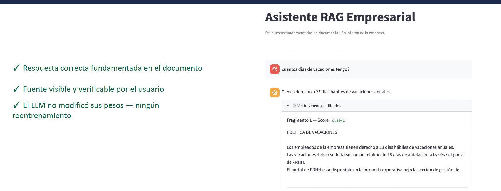

# Enterprise RAG Assistant

A local, privacy-first Retrieval-Augmented Generation (RAG) system that answers employee questions using a company's internal documentation — instead of relying on an LLM's general knowledge, which often produces confident but incorrect answers.

This project demonstrates the full RAG pipeline end to end: document ingestion, chunking, embedding generation, vector storage, retrieval, and grounded answer generation — running entirely on local infrastructure with open-source models.

## Why RAG instead of just an LLM?

General-purpose LLMs don't know your company's specific policies. When asked, they either refuse or — more dangerously — hallucinate a plausible-sounding but wrong answer. This project includes a side-by-side evaluation script (`evaluar.py`) that demonstrates exactly this problem using a small set of HR policy questions, comparing:

- **LLM only**: the model answers from its parametric knowledge alone.
- **LLM + RAG**: the model answers using context retrieved from the actual company documents.

The difference is the entire point of the project.

> Note: the HR policy documents used in this demo are fictional, created specifically to test and showcase the system.

## How it works

1. **Ingestion** (`indexar.py`) — reads source documents, splits them into overlapping chunks (256 tokens, 20 overlap), and generates embeddings for each chunk using a multilingual sentence-transformer model.
2. **Storage** — embeddings are persisted in ChromaDB, a local vector database, so indexing only needs to run once.
3. **Retrieval + generation** (`consultar.py` / `app.py`) — a user question is embedded using the same model, the most similar chunks are retrieved via cosine similarity, and Llama 3.1 generates an answer grounded in that retrieved context.
4. **Evaluation** (`evaluar.py`) — runs the same questions with and without RAG to make the accuracy difference visible.

## Tech stack

| Component | Technology |
|---|---|
| Orchestration | [LlamaIndex](https://www.llamaindex.ai/) |
| Vector database | [ChromaDB](https://www.trychroma.com/) |
| Embeddings | `sentence-transformers/paraphrase-multilingual-mpnet-base-v2` |
| LLM | Llama 3.1 8B via [Ollama](https://ollama.com/) (fully local inference) |
| Interface | [Streamlit](https://streamlit.io/) |

Everything runs locally — no API keys, no data leaving the machine. This matters for enterprise use cases where internal documentation can't be sent to third-party APIs.

## Interface

The Streamlit app provides a chat-style interface. Each answer is grounded in retrieved context, and the source chunks used to generate it are shown alongside their similarity score, so answers are auditable rather than opaque.



## Getting started

```bash
# 1. Clone and install dependencies 
pip install -r requirements.txt

# 2. Pull the local LLM (requires Ollama installed)
ollama pull llama3.1

# 3. Index your documents (place them in /documentos)
python indexar.py

# 4. Launch the chat interface
streamlit run app.py
```

To run the RAG vs. no-RAG comparison instead:

```bash
python evaluar.py
```

## Project structure

```
.
├── documentos/        # source documents to be indexed (fictional HR policies for the demo)
├── indexar.py          # ingestion + embedding + indexing pipeline
├── consultar.py         # command-line query script
├── app.py            # Streamlit chat interface
├── evaluar.py          # RAG vs. no-RAG comparative evaluation
└── requirements.txt
```

## Status

This is a functional prototype built as part of an academic project on improving the accuracy of enterprise AI assistants through retrieval-augmented generation. The core pipeline — ingestion, retrieval, grounded generation, and evaluation — is complete and working end to end.
